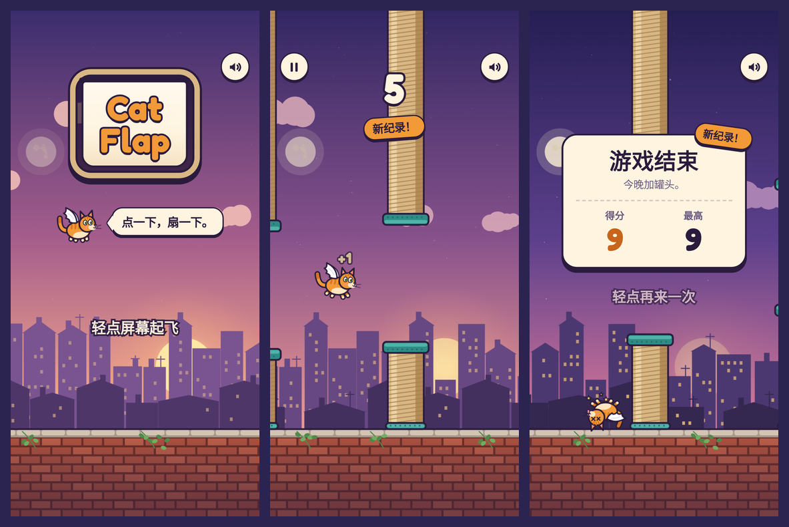

# Cat Flap

一键操作的浏览器小游戏：点一下，长着小翅膀的橘猫就扇一下，从猫爬架之间飞过去。

**在线试玩：<https://wowayou.github.io/cat-flap/>**（手机、电脑都可以）



TypeScript + Canvas 2D + Web Audio，**零运行时依赖**（仅打包一个自托管字体），构建产物约 16 KB JS（gzip）。

## 运行

```bash
npm install
npm run dev        # http://localhost:5173 ，同一 Wi‑Fi 下手机可用局域网 IP 打开
npm run build      # 类型检查 + 生产构建到 dist/（纯静态，可放任何静态托管）
npm run preview    # 预览生产构建
```

推送到 `main` 后，GitHub Actions（[`.github/workflows/deploy.yml`](.github/workflows/deploy.yml)）会依次做类型检查、单元测试、构建，全部通过才发布到 GitHub Pages。端到端测试需要浏览器，不在部署流程里跑，发布前请本地执行 `npm run e2e`。

| 操作 | 桌面 | 手机 |
|---|---|---|
| 扇翅 / 开始 / 重来 / 继续 | 空格、↑、W、鼠标左键 | 轻点屏幕 |
| 暂停 | P、Esc、左上角按钮 | 左上角按钮 |
| 静音 | M、右上角按钮 | 右上角按钮 |

URL 参数：`?bot` 自动驾驶演示（死了自动重开）；`?bot=5` 打到 5 分后停手；`?debug` 显示碰撞框、帧率、种子。

## 核心循环

```
READY ──点一下(同时起飞)──▶ PLAYING ⇄ PAUSED(切后台自动暂停，恢复时 3‑2‑1)
                              │ 撞柱 / 撞墙
                              ▼
                            DYING(失控翻肚皮掉落，不响应输入)
                              ▼
                           GAMEOVER ──点一下(0.55s 防误触后)──▶ READY
```

三种输入（空格 / 鼠标 / 触摸）都只调用同一个 `Game.flap()`；按住不会连发。重开不刷新页面。

## 与 PRD 不同、或超出 PRD 的决定

| 决定 | 原因 |
|---|---|
| **碰到顶部是"撞头反弹"，不死** | 顶部柱子本来就延伸到屏幕外，贴顶飞不可能绕过障碍；死于一条看不见的线属于"明明没碰到却死了"。 |
| **固定 120Hz 模拟步长 + 渲染插值**（而非可变 delta） | 30/60/144Hz 屏幕上的物理**逐位相同**（有测试），而不只是"差不多"。单帧最长只补 0.1s。 |
| **障碍是猫爬架**（剑麻柱 + 地毯平台），地面是砖墙 | 题材统一；碰撞形状 = 画出来的形状（柱 + 更宽的平台），各边再内缩 2px 宽恕。猫的美术大于 13px 碰撞圆。 |
| **关卡生成受物理可达性约束** | 相邻缺口的高度差不超过"以人类节奏（≥0.18s/次）点击能爬升 / 下坠的距离"的 85%，并有证明器验证（见下）。前 4 个障碍逐步放开幅度作为新手引导。 |
| **难度只调速度和（轻微）缝隙** | 速度 150→210 px/s、缝隙 172→148 px 随分数连续变化并封顶；重力和起跳力永不改变，玩家学会的手感一直有效。 |
| **中途超过最高分时弹"新纪录！"** | 破纪录那一刻最兴奋，不必等到结算。 |
| **"猫有九条命，还剩 N 条"** | 结算文案把重开变成笑点；用完就"再借九条"，不限制次数。 |
| 背景随分数从日落 → 夜晚 → 黎明循环 | 只变背景；猫、柱子、墙的颜色恒定，保证可读性。 |
| 中英双语 | 按浏览器语言自动选择。 |

## 调参

所有手感 / 公平性参数集中在 [`src/game/config.ts`](src/game/config.ts)（重力、起跳速度、速度曲线、缝隙、间距、碰撞宽恕、公平性模型等），代码其他地方没有魔法数。改完后跑：

```bash
npm test               # 单测 + 可通过性证明，会告诉你新参数是否仍然公平
npm run calibrate      # 用"有手抖的模拟玩家"估计各水平玩家的得分分布
```

当前参数的校准结果（每档 400 局，数值是得分）：

| 模拟玩家 | p10 | 中位数 | p90 | ≥10 分 |
|---|---|---|---|---|
| 第一次玩 | 0 | 3 | 9 | 9% |
| 休闲 | 1 | 5 | 21 | 30% |
| 熟练 | 2 | 17 | 70 | 65% |
| 高手 | 15 | 137 | 300+ | 94% |

这个玩家模型很粗糙（点击延迟抖动 + 注意力漂移），只适合**比较不同参数**，不代表真人绝对水平。

## 验证

- **`npm test`**（Vitest，73 项）：物理、帧率无关性、碰撞（20 万次随机采样验证"离画出的形状 ≥ 半径就绝不判死"、"明显重叠就一定判死"）、状态机与重开、计分只算一次、对象池上限、确定性回放、生成器约束、存储容错、输入映射、文案完整性。
- **可通过性证明**（[`tools/oracle.ts`](tools/oracle.ts)）：对每个种子录下整条关卡，在"两次点击间隔 ≥ 0.18s"的约束下搜索点击时机，**找到一条真实物理下能活到 100 分的操作序列**才算通过；测试覆盖 24 个种子，另有 0.3s（每秒 3.3 次）的慢速验证。证明器本身也有反例测试（不可能的关卡必须被判不可通过）。
- **`npm run e2e`**（Playwright，生产构建）：桌面 Chromium / Firefox、iPhone 13（WebKit）、Pixel 7（Chromium 触摸）上的完整流程、最高分刷新后保留、静音持久化、按钮不误触发扇翅、切后台暂停与倒计时恢复、中途破纪录、6 种屏幕尺寸布局；音效在浏览器里离线渲染后**实测**响度、削波、是否能在手机扬声器（>500Hz）上听到、是否正常结束。
- **性能 / 内存**（[`tools/perf.mjs`](tools/perf.mjs)，headless Chromium 自动驾驶 60s）：每帧 JS 耗时中位数 0.5–0.6ms、p99 ≈ 1.1–1.4ms，稳定 60fps；150s 浸泡（含 16 次死亡重开）后堆快照对比没有任何应用对象增长，增量只来自 V8 的 JIT 代码和有上限的数字字符串缓存。

## 结构

```
src/
  game/        纯模拟，无 DOM：Game(状态机) physics collision obstacles(生成) difficulty loop(固定步长) rng autopilot config
  render/      只读 Game 的绘制：Renderer scenery posts cat fx palette view
  audio/       Web Audio 合成音效（无音频文件）+ 管理器（手势解锁、静音）
  ui/          DOM 界面（HUD / 开始 / 暂停 / 结算）与中英文案
  storage/     localStorage：仅最高分与声音开关，读写全部容错
  input.ts     设备 → 动作映射
  main.ts      组装与主循环
tools/         oracle(可通过性证明) calibrate(难度校准) perf.mjs(性能浸泡) gallery(美术预览，npm run dev 后打开 /tools/gallery.html)
tests/  e2e/
```

## 已知限制

- iOS 静音拨片打开时 Web Audio 不发声（系统行为）；震动反馈只在支持 `navigator.vibrate` 的安卓浏览器上有。
- 没有 Service Worker：首次加载后断网不保证可玩。
- 校准用的玩家模型是近似；真实手感仍需要真人试玩来最终确认。
