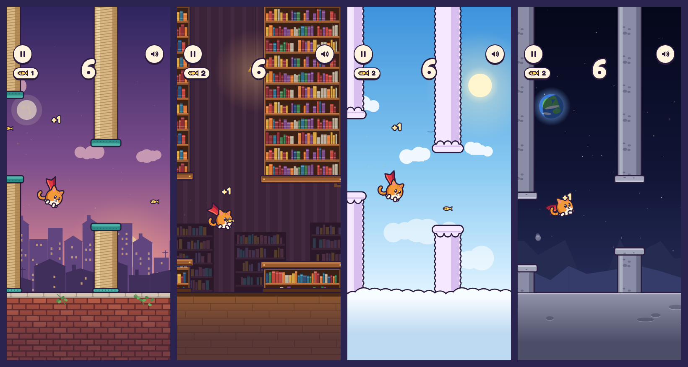

# Cat Flap

一键操作的浏览器小游戏：点一下，披着红斗篷的橘猫就往上一冲，从障碍之间飞过去；按住不放，红斗篷张开滑翔。四张地图各有不同的玩法：花园围墙的经典猫爬架、午夜书房的长书架隧道、云端会上下浮动的云柱、月球的低重力。沿途的小鱼干能补充披风能量。飞完可以把这条航线连同你的“幽灵猫”发给朋友，大家在同一条航线上异步比赛，不需要服务器。

**在线试玩：<https://wowayou.github.io/cat-flap/>**（手机、电脑都可以）


TypeScript + Canvas 2D + Web Audio，**零运行时依赖**（仅打包一个自托管字体），构建产物约 33 KB JS（gzip）。

主角是披燕尾红披风的圆球橘猫小英雄：头和身体是同一个圆，画出来的圆基本就是碰撞判定。点一下沿冲劲拉长，下落时披风被气流扬起，按住滑翔时披风像翅膀一样张开；平涂加场景统一的深紫描边，和场景、界面是同一种矢量画风。[角色与动作预览](docs/character.png) · [角色设计与验收说明](docs/character.md)。

## 运行

```bash
npm install
npm run dev        # http://localhost:5173 ，同一 Wi‑Fi 下手机可用局域网 IP 打开
npm run build      # 类型检查 + 生产构建到 dist/（纯静态，可放任何静态托管）
npm run preview    # 预览生产构建
```

推送到 `main` 后，GitHub Actions（[`.github/workflows/deploy.yml`](.github/workflows/deploy.yml)）会依次做类型检查、单元测试、构建，全部通过才发布到 GitHub Pages。端到端测试需要浏览器，不在部署流程里跑，发布前请本地执行 `npm run e2e`。

| 操作 | 桌面 | 手机 | 手柄 |
|---|---|---|---|
| 起飞 / 开始 / 重来 / 继续 | 空格、↑、W、鼠标左键 | 轻点屏幕 | A/B/X/Y、肩键、扳机、十字键上 |
| 滑翔 | 按住上面任一键不放 | 按住屏幕不放 | 按住不放 |
| 换地图（开始页） | ←/→、A/D、卡片两侧箭头 | 卡片两侧箭头 | 十字键 ←/→ |
| 暂停 | P、Esc、左上角按钮 | 左上角按钮 | Start |
| 静音 | M、右上角按钮 | 右上角按钮 | Back/Select |
| 分享挑战 | 结算卡片上的按钮 | 同左 | — |

URL 参数：`?map=garden|library|clouds|moon` 选地图；`?c=…` 好友挑战链接（见下）；`?bot` 自动驾驶演示（死了自动重开）；`?bot=5` 打到 5 分后停手；`?debug` 显示碰撞框、小鱼干拾取范围、披风能量、帧率、种子。

## 核心循环

```
READY ──点一下(同时起飞)──▶ PLAYING ⇄ PAUSED(切后台自动暂停，恢复时 3‑2‑1)
                              │ 撞柱 / 撞墙
                              ▼
                            DYING(失控翻肚皮掉落，不响应输入)
                              ▼
                           GAMEOVER ──点一下(0.55s 防误触后)──▶ READY
```

所有输入（键盘 / 鼠标 / 触摸 / 手柄）的按下都只调用同一个 `Game.flap()`，按住不会连发；“按住”是另一条电平信号 `Game.setHold()`，多个手指、按键、手柄同时按着时，全部松开才算松开，页面失焦时自动松开。重开不刷新页面。

## 地图与玩法



在开始页用卡片两侧的箭头（或 ←/→）换地图，会记住上次的选择。

| 地图 | 场景 | 不一样的地方 |
|---|---|---|
| 花园围墙（经典） | 日落到夜晚的城市、砖墙、猫爬架 | 原版规则，航线与改版前逐位相同 |
| 午夜书房 | 条纹墙纸、拱窗月光、吊灯、远处书柜、木地板 | 一半障碍是更宽的书架，最长的是“隧道”，要在里面稳住高度 |
| 云端漫步 | 白天的天空、太阳、云海 | 大多数云柱会随着靠近上下浮动（淡紫色的会动，白色的不动） |
| 月球 | 星空、地球、月岭、陨石坑 | 重力和起跳都更弱，下落更慢；缝隙更窄 |

- **按住滑翔**：点一下的冲刺完全不变；冲到最高点之后仍按着，披风张开，下落被稳住在 130 px/s。一整块披风能飞 1.6 秒，不滑翔时慢慢回充，头顶的小圆环显示剩余能量；用完后要再按一下才能重新张开。
- **小鱼干**：约六成障碍带一条，一部分在缝隙里靠近边缘（有点险），一部分飘在两道障碍之间、偏离直线。每条回充三分之一披风。只计数，不加分。
- **星星**：每张地图的最高分到 10 / 25 / 50 分各点亮一颗；每张地图各自记录最高分（花园沿用原来的存储键，老玩家的纪录不丢）。

## 好友挑战（幽灵猫）

单靠“刷最高分”只有和自己比；这里把每一局变成可以发给朋友的比赛：

1. 结算卡片上填个昵称，点 **发起挑战**：链接里带着地图、这条航线（种子）和你这一局的录像。手机上走系统分享面板，不支持时复制到剪贴板。
2. 朋友打开链接（不管自己选的是哪张地图，都会切到挑战的地图），开始页列出要追的人；起飞后你的猫以**半透明剪影**和名字牌在同一条航线上陪飞，撞柱的幽灵会留在原地被甩在后面，超过谁时弹出“超过 小明！”。挑战模式下每次重开都是同一条航线。
3. 朋友结算时看到这条航线的排名，点 **接力分享**，新链接里就有你们两个人的幽灵；在群里一路传下去，最多保留 5 只（自己的只保留更好的一局，超出时去掉最低分）。

实现要点：

- **录像就是输入**：模拟是固定步长、只用加减乘除、取整、绝对值这类 IEEE 精确运算（云柱的浮动也是用三角波加平滑曲线算的，不用 `Math.sin`），所以“地图 + 种子 + 起飞时的位置 + 每次点击发生在第几步 + 滑翔的开关时刻”就能在任何设备上逐位重放整局（[`src/social/replay.ts`](src/social/replay.ts)）。滑翔只记录“过了最高点还按着”这个状态的切换，普通点击不增加任何字节；一局约每秒 2–3 字节，常滑翔的约 4–5 字节，50 分的挑战链接只有几百个字符。
- **分数不靠链接自报**：打开链接时把每只幽灵完整重放一遍，算出来的分数和链接里写的不一致就丢掉（被改过的链接、或旧版本录的局）。录像本身仍可能由脚本生成，这只能防“改数字”，不能防“机器人代打”。
- **规则变了，旧链接作废**：链接里有一个由 [`config.ts`](src/game/config.ts) 和 [`maps.ts`](src/game/maps.ts) 全部参数算出的签名；调参后旧链接会提示“来自旧版本”，回到普通模式。例外：加入地图和滑翔之前发出的链接（格式 1）只可能是花园、只有点击，而花园的规则一点没变，所以这些老链接仍然有效（有跨引擎测试锁定）。
- **隐私**：只在本机保存昵称和一个随机设备 ID（用来在链接里认出“自己之前那一局”）；链接里只有昵称、分数和录像，没有任何上传。

## 与 PRD 不同、或超出 PRD 的决定

| 决定 | 原因 |
|---|---|
| **碰到顶部是"撞头反弹"，不死** | 顶部柱子本来就延伸到屏幕外，贴顶飞不可能绕过障碍；死于一条看不见的线属于"明明没碰到却死了"。 |
| **固定 120Hz 模拟步长 + 渲染插值**（而非可变 delta） | 30/60/144Hz 屏幕上的物理**逐位相同**（有测试），而不只是"差不多"。单帧最长只补 0.1s。 |
| **障碍是猫爬架**（剑麻柱 + 地毯平台），地面是砖墙；其他地图是书架、云柱、月岩 | 题材统一；不管画成什么，碰撞形状都 = 画出来的形状（窄柱 + 缝隙边上更宽的平台），各边再内缩 2px 宽恕；云柱的绒边只往外多画 2px，偏向宽松。猫的美术大于 13px 碰撞圆。 |
| **关卡生成受物理可达性约束** | 相邻缺口的高度差不超过"以人类节奏（≥0.18s/次）点击能爬升 / 下坠的距离"的 85%，按每张地图自己的重力、起跳和速度计算；浮动的缝隙还要再扣掉猫在缝隙里时它能漂移的距离。每张地图都有证明器验证（见下）。前 4 个障碍逐步放开幅度、并且一定是普通障碍，作为新手引导。 |
| **难度只调速度和（轻微）缝隙** | 花园：速度 150→210 px/s、缝隙 172→148 px 随分数连续变化并封顶；同一张地图里重力和起跳力永不改变，玩家学会的手感一直有效。 |
| **第二种操控是“按住滑翔”，不是第二个按钮** | 仍然是一键：任何设备上同一根手指就能做。点击的冲刺逐位不变，所以老手感、老挑战链接都不受影响；只在冲过最高点后才张开，快速点击时手指按得慢一点也不会误触发。披风能量限制滑翔时长，避免一直按住就变简单；可通过性证明只用点击，滑翔永远是可选的。 |
| **小鱼干回充披风，不加分** | 得分仍是“飞过几根柱子”，各地图、改版前后的分数和挑战排名保持可比；小鱼干带来“冒险去吃 → 换更多滑翔”的取舍。放置用独立的随机流，花园的航线与改版前逐位相同。 |
| **四张地图都直接开放，用星星当目标** | 不设解锁门槛，朋友发来任何地图的挑战链接都能直接玩；每张地图 10 / 25 / 50 分三颗星提供目标，各自记录最高分。 |
| **云柱的浮动按“离猫多远”计算，而不是按时间** | 这样猫飞到每个缝隙时缝隙在哪，生成时就确定了，可以纳入可达性约束和证明，也和速度无关；会动的云柱染成淡紫色，开动之前就能认出来。 |
| **地图参数各自独立，花园就是原版常量** | [`maps.ts`](src/game/maps.ts) 里每张地图一组规则，改一张只影响它自己；花园直接引用原来的常量，老的最高分与老挑战链接继续有效。 |
| **中途超过最高分时弹"新纪录！"** | 破纪录那一刻最兴奋，不必等到结算。 |
| **"猫有九条命，还剩 N 条"** | 结算文案把重开变成笑点；用完就"再借九条"，不限制次数。 |
| **主角是抽象的圆球猫，矢量画风** | 头和身体是同一个圆（半径 17），碰撞圆（13）正好在里面，四周宽恕均匀，看起来碰到和实际判定一致。全部由圆、圆角三角和曲线组成，旋转、挤压拉伸都不走形；平涂加 2.5 单位的墨色描边，和障碍物、界面同一画风。之前的两版像素猫和矢量场景画风不统一，已替换。应用图标把游戏自己的绘制调用录制成 SVG，是真正的矢量。 |
| **像超级英雄一样飞：红披风代替翅膀** | 燕尾红披风上有一道沿长度传播的波浪，方向由飞行速度算出（俯冲时扬起、爬升时贴在背后），点击时带起更大的波；按住滑翔时连续张开成翅膀的形状。前爪上升时向前伸、下落时放下，尾巴稍晚跟随。暂停冻结所有动作，重开恢复姿态；减少动态效果模式关闭挤压拉伸、披风波动与连续翻滚。 |
| 背景随分数从日落 → 夜晚 → 黎明循环 | 只变背景；猫、柱子、墙的颜色恒定，保证可读性。 |
| 中英双语 | 按浏览器语言自动选择。 |
| **社交做成“链接里带录像”，不做排行榜服务器** | 纯静态托管即可运行，零成本；好友之间同航线异步竞速比全球榜更有互动感（参考 Flappy Royale 的异步幽灵），并且分数可由重放验证。全球榜需要后端和反作弊，是另一个决定。 |
| **不做“每日航线”** | 关卡生成已受公平性约束，随机航线之间难度相近，比分数不需要同一张图；需要同图比赛时，挑战链接本身就固定了航线。 |
| **幽灵猫是同一只猫的半透明剪影** | 同一套几何画成好友毛色（黑、银、白、蓝灰、棕）的平涂剪影，只保留深色的眼睛和嘴，不和你自己的猫抢视线。所有猫都直接画进场景：先画进离屏画布再整体半透明虽然更“纯”，但实测每只幽灵每帧多 0.7ms（Chromium）到约 6ms（无头 WebKit），不值得。为了直接画也不难看，披风、尾巴裁在圆球外面不透过身体，也不画描边和层层细节，任何位置都不会变成不透明。 |
| **分享按钮也遵守 0.55s 防误触，并放在屏幕中线以上** | 结算是“点哪里都重来”，分享行避开拇指最常点的中下部，防误触期间不响应。 |

## 调参

所有手感 / 公平性参数集中在 [`src/game/config.ts`](src/game/config.ts)（碰撞宽恕、公平性模型、滑翔与披风能量、小鱼干等）和 [`src/game/maps.ts`](src/game/maps.ts)（每张地图的重力、起跳速度、速度曲线、缝隙、间距、书架宽度、浮动幅度），代码其他地方没有魔法数。改完后跑：

```bash
npm test                         # 单测 + 每张地图的可通过性证明，会告诉你新参数是否仍然公平
npm run calibrate                # 用"有手抖的模拟玩家"估计各水平玩家在每张地图上的得分分布
npm run calibrate -- 400 moon    # 只看一张地图
```

当前参数的花园校准结果（每档 400 局，数值是得分；和加入地图之前完全相同）：

| 模拟玩家 | p10 | 中位数 | p90 | ≥10 分 |
|---|---|---|---|---|
| 第一次玩 | 0 | 3 | 9 | 9% |
| 休闲 | 1 | 5 | 21 | 30% |
| 熟练 | 2 | 17 | 70 | 65% |
| 高手 | 15 | 137 | 300+ | 94% |

其他地图（中位数 · ≥10 分的比例，每档 400 局）：

| 地图 | 第一次玩 | 休闲 | 熟练 | 高手 |
|---|---|---|---|---|
| 午夜书房 | 3 · 12% | 5 · 31% | 13 · 61% | 107 · 92% |
| 云端漫步 | 3 · 19% | 9 · 50% | 39 · 79% | 261 · 98% |
| 月球 | 3 · 16% | 9 · 49% | 47 · 86% | 300+ · 100% |

这个玩家模型很粗糙（点击延迟抖动 + 注意力漂移），只适合**比较不同参数**，不代表真人绝对水平。它只点击、不滑翔，而且预先知道浮动的云柱会在哪个高度和猫相遇，所以云端对真人会比表里难。月球的低重力让每一下点击的误差都更小，模拟玩家因此飞得更远；它的缝隙已经是四张图里最窄的（146→128 px），再收窄对真人就太苛刻了，所以把它当作手感最轻松的一张。

## 验证

- **`npm test`**（Vitest，192 项）：物理、帧率无关性、碰撞（20 万次随机采样验证"离画出的形状 ≥ 半径就绝不判死"、"明显重叠就一定判死"）、状态机与重开、计分只算一次、对象池上限、确定性回放、生成器约束、存储容错、输入映射（含输入框打字不触发起飞）、文案完整性；好友挑战：录像逐步重放与得分/坠毁步数逐位一致（含中途暂停）、链接编解码与截断/垃圾/旧版本拒绝、篡改分数被重放识破、幽灵合并规则、超越判定；角色动作：暂停、重置、点击时拉长抬头、下落表情、撞天花板眯眼压扁、滑翔张开披风并前伸双爪、叼小鱼干张嘴、减少动态效果以及不修改模拟状态；幽灵毛色映射。
  - **地图**：前 4 个障碍一定是普通的；书架宽度只取地图配置里的值；浮动缝隙的整个行程都在场地内，猫到障碍正中时缝隙恰好在计划高度。
  - **滑翔**：按不按住，点击后的上升段逐位相同；过了最高点稳定在滑翔速度；快速下落会被刹到滑翔速度；满能量正好滑 `GLIDE.duration` 秒，用完后再按一下才能重新张开；不滑翔时回充，每局重新充满；只有“过了最高点还按着”才写进录像，普通点击一个字节都不加。
  - **小鱼干**：不改变花园的任何一根柱子；四张地图上每一条都能在不碰任何东西的情况下吃到；数量约为配置的比例，缝隙里和空地上都有；吃一次只算一次并回充能量；同一种子位置不变。
  - **录像与链接**：带滑翔的整局逐位重放，重放时记录出的按住切换与原局相同；链接带上地图和按住切换；按住序列不递增、未知地图编号都会被拒绝；加入地图之前的格式 1 链接仍以花园打开并通过重放验证，重新分享后内容不变。
  - **输入**：键盘、指针、多指之间共享“按住”，全部松开才算松开，页面失焦自动松开；手柄的按下沿起飞、松开沿松手、Start 暂停、十字键换地图、断开时松开。
- **可通过性证明**（[`tools/oracle.ts`](tools/oracle.ts)）：对每个种子录下整条关卡，在"两次点击间隔 ≥ 0.18s"的约束下搜索点击时机，**找到一条真实物理下能活到 100 分的操作序列**才算通过；花园覆盖 24 个种子，书房、云端、月球各 16 个，每张地图另有 0.3s（每秒 3.3 次）的慢速验证。证明器用每张地图自己的重力和起跳，书架按实际宽度、浮动缝隙按每一步的实际位置计算；证明里只点击、不滑翔。证明器本身也有反例测试（不可能的关卡必须被判不可通过）。自动驾驶在每张地图的 20 个以上种子上都能飞到 60 分。
- **`npm run e2e`**（Playwright，生产构建，93 项通过、31 项按配置跳过）：桌面 Chromium / Firefox、iPhone 13（WebKit）、Pixel 7（Chromium 触摸）上的完整流程、最高分刷新后保留、静音持久化、按钮不误触发起飞、切后台暂停与倒计时恢复、中途破纪录、6 种屏幕尺寸布局（含地图卡片不越界、不压住标题和开始提示）；选地图（箭头、循环、刷新后保留、不误触发起飞、←/→ 只在开始页有效）、按住滑翔（键盘和触摸：点一下会落地，按住 1.5 秒仍在飞）、小鱼干计数与结算、各地图独立最高分、挑战链接自带地图（打开时切到挑战的地图，退出后回到自己选的）、模拟手柄（换地图、起飞并按住滑翔、Start 暂停）、分享行始终在屏幕中线以上；好友挑战全流程（分享 → 另一台设备打开 → 同飞并超越 → 排名 → 接力分享出含两人的链接）、退出挑战、坏链接提示、无 Web Share 时复制到剪贴板、输入昵称不触发重开；**跨 JS 引擎重放**：两条在 Node（V8）里录的链接——改版前的三人花园链接，以及三只在云端浮动缝隙间滑翔的幽灵——在 Firefox（SpiderMonkey）和 WebKit（JavaScriptCore）里都重放出完全相同的分数。音效（含新的滑翔、披风用完、吃小鱼干）在浏览器里离线渲染后**实测**响度、削波、是否能在手机扬声器（>500Hz）上听到、是否正常结束。
- **美术专项**（[`e2e/art.spec.ts`](e2e/art.spec.ts)，四种浏览器）：27 种姿态（最大倾角、拉伸与压扁、张开的披风、爪子前伸与放下、各种表情 × 3 个披风相位，以及翻滚一整圈和落地压扁）检查碰撞圆完整藏在实心造型里、整只猫不碰画布边；幽灵不超出玩家轮廓、身体盖满碰撞圆、纯毛色处正好一半透明、任何位置都不会不透明；四张地图上、正在滑翔时暂停，五只幽灵的位置插值和每张地图的背景动画都不能改变画面像素。
- **性能 / 内存**（[`tools/perf.mjs`](tools/perf.mjs)，2026-10-05 换成矢量圆球猫后复测，headless Chromium）：用 `npm run preview -- --host 127.0.0.1 --port 4175` 启动生产预览后，执行 `node tools/perf.mjs 60 'http://127.0.0.1:4175/?bot&map=<地图>' --ghosts`，自动生成并验证五份长录像，检查每一帧都实际绘制了五只幽灵。花园、书房、云端在桌面 1280×800 与手机配置 390×844 各采样 60 秒，每帧 JS 耗时中位数 0.5–0.6ms，p99（99% 帧不超过的耗时）1.8–2.0ms；帧率 55.5–59.6fps（测量时机器有别的负载：同样条件下改版前的版本是 57.6–58.0fps，新角色不带幽灵是 57.7–57.9fps，没有退步）。云端最初在手机配置上只有 52fps（JS 很轻，慢在光栅化：给几十个绒边描 5px 粗边），改成“先填一个放大的墨色形状再盖上本色”后回到 60fps；书架的书本图案每种宽度只在开始页画一次，飞行中只是贴图。回收后的 JS 堆约 2.3→2.7MB（包含采样数组）；这次采样不等同于长期泄漏证明，手机配置也不等同于真机性能。

## 结构

```
src/
  game/        纯模拟，无 DOM：Game(状态机、滑翔、小鱼干) maps(四张地图的规则) physics collision obstacles(生成：书架宽度、浮动缝隙、小鱼干) difficulty loop(固定步长) rng autopilot config
  render/      只读 Game 的绘制：Renderer themes(每张地图的背景与障碍) scenery+posts(花园) library clouds moon cat(矢量圆球猫、幽灵换毛色、小鱼干) animator(姿态) fx palette view
  social/      好友挑战，纯逻辑无 DOM：replay(录像重放) link(链接编解码/验证/合并) squad(同飞的幽灵、超越、排名)
  audio/       Web Audio 合成音效（无音频文件）+ 管理器（手势解锁、静音）
  ui/          DOM 界面（HUD / 开始页选地图 / 暂停 / 结算）与中英文案
  storage/     localStorage：每张地图的最高分、上次选的地图、声音开关、昵称与随机设备 ID，读写全部容错
  input.ts     设备 → 动作映射（按下 / 按住 / 松开，含手柄轮询）
  main.ts      组装与主循环
tools/         oracle(可通过性证明) calibrate(难度校准，可指定地图) perf.mjs(性能采样，--ghosts 验证五只全程同屏) gallery(美术预览，npm run dev 后打开 /tools/gallery.html) art-assets.mjs(图标与截图导出)
tests/  e2e/
```

## 已知限制

- iOS 静音拨片打开时 Web Audio 不发声（系统行为）；震动反馈只在支持 `navigator.vibrate` 的安卓浏览器上有。
- 没有 Service Worker：首次加载后断网不保证可玩。
- 校准用的玩家模型是近似；真实手感仍需要真人试玩来最终确认。它预先知道浮动缝隙会在哪个高度和猫相遇，所以会低估“云端漫步”对真人的难度；它也不滑翔，只代表不用披风时的难度。
- 挑战链接与规则版本绑定：改 `config.ts` 或 `maps.ts` 后，新格式的旧链接全部作废（会提示），`e2e/social.spec.ts` 里的 `GOLDEN_V2` 样本链接也要重新生成。格式 1 的老链接靠“花园规则从未改变”继续有效，`GOLDEN` 样本锁定了这一点；真要改花园规则，需要同时让格式 1 失效并删掉这条样本。
- 部分浏览器不把手柄按键算作用户手势，声音可能要等一次点击或按键才会开始（未逐一验证）。
- 微信等 App 内置浏览器通常没有系统分享面板，会退到复制链接；若剪贴板也被禁止，则弹出链接让玩家手动复制。这些内置浏览器没有在真机上验证过。
